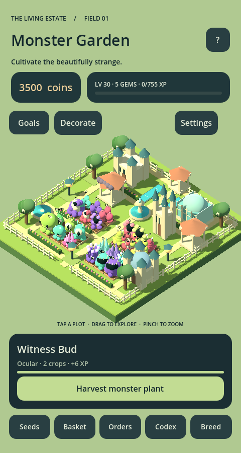

# Monster Garden

A portrait isometric mobile game about cultivating the beautifully strange.
**Godot 4.3 · GDScript · Mobile renderer · Android ARM64**



## Play in the editor

1. Clone this repository and import `project.godot` in **Godot 4.3**.
2. Wait for imports, then press **F5**.
3. Follow the skippable tutorial: plant → wait → harvest → sell → deliver → breed.
4. Start with **six owned plots**. The other 18 sites require both their keeper level
   and a purchase. Gems cannot bypass the level requirement.
5. Use **Decorate** to buy level-gated ornaments, choose their sites, move them or
   return them to storage. The manor and conservatory are earned decorations.

Tap plots, drag to pan, pinch to zoom. Desktop: click, drag, mouse wheel.
The opening garden is intentionally smaller than the developed garden pictured above.
Commons start at 30 seconds; Mythics take hours. Progress is saved automatically
and growth uses real timestamps, including while the app is closed.

## What's implemented

- **120 monster species / ten families / five rarities**, generated as JSON data;
  90 level unlocks and 30 event unlocks, including breeding, quests, reputation,
  seasonal windows and spore drifts. Locked species remain visible in the codex.
- One **AssetFactory** resolves all models, including five original Witness Bud
  GLBs and family geometry. Growth stages, hue, scale, appendages, glow and motion
  come from data; replacing an art path requires only a catalog edit.
- Gene-aware crop stacks, a purchasable **breeding bench**, inherited and mutated
  seed genes, rare species recipes and one-time discovery rewards.
- Signal-driven progression quests, three UTC daily goals and claimable rewards.
- Three simultaneous courier orders, expiry/cooldowns, mixed and gene-specific
  requests, coin/gem rerolls and reputation tiers.
- Offline summary, earned gems, rare seeds, instant growth and fertiliser.
- A landscaped estate with 24 reusable plot holders, ten purchasable decoration
  types and twelve placement sites, inspired by the supplied reference layout.
- Harvest/plant tweens, floating rewards, pooled GPU particles, counter animation,
  level feedback, original synthesized music/SFX/UI sounds and volume controls.
- Saved, quest-driven onboarding; settings, confirmed reset and local analytics logs.
- Schema **12** local saves, backups, legacy migrations and future-version protection.
  Optional Firebase REST backend uses the **same** `save_data` / `load_data` interface.

## Integration boundaries

The game runs offline without accounts or paid services. Firebase is **disabled by
default**; anonymous auth, conditional writes and conflict selection are implemented,
 but live configuration and credentials are not included. See [cloud setup](docs/CLOUD_SAVE.md).
Android notifications have an isolated plugin contract and are a no-op without a
native plugin. IAP and account linking are explicit stubs; there is no store SDK or
real purchase flow. Analytics only logs locally.

A signed APK, notification delivery and physical Android performance have **not**
been validated. See [measured desktop results and device checklist](docs/PERFORMANCE.md).

## Test and reproduce

```sh
GODOT_BIN=/path/to/godot python tools/verify.py
python tools/expand_species.py
```

The verifier imports assets and runs gameplay, legacy-save, art, breeding, quest,
order, offline, booster, tutorial, cloud-protocol and settings checks using isolated
saves. [Testing guide](docs/TESTING.md) lists editor acceptance steps for each system.
[Art guide](docs/ART_PIPELINE.md) explains GLB swaps and regeneration.

With a desktop display, capture the actual full garden and compare batching:

```sh
python tools/profile_garden.py --godot /path/to/godot
```

## Android export

Install Godot **4.3 export templates**, OpenJDK **17**, and the Android SDK. Configure
Java/Android SDK paths in Editor Settings, then **Project → Export → Android**.
The included ARM64 preset targets `builds/monster-garden.apk`; create that directory
before export. Use debug export for device testing. Keep release signing keys private.
[Godot's Android export instructions](https://docs.godotengine.org/en/4.3/tutorials/export/exporting_for_android.html).

## Architecture

Game rules live in `scripts/core`; UI sends commands and displays signals.
`Events` is the shared signal surface. New state registers in `Game.SAVE_MODULES`
and migrates in `SaveManager`. `AssetFactory` owns all mesh resolution/construction;
`GardenArt` is its private geometry helper. Static pieces batch into vertex-colored
surfaces; plant roots still animate independently. Plot holders and particle emitters
are reused rather than rebuilt every frame.

This repository started empty. The actual foundation v1 and art v2 save fixtures
are included; compatibility with an unseen earlier game is not claimed.
Original project geometry, models, icon and sound; Godot is MIT-licensed.
